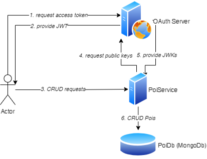
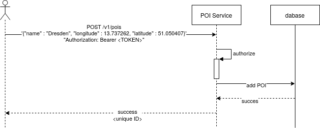

# Structure
The following image shows a basic overview of the system setup. 

The system consists of the requesting client, the poi service itself, the OAuth server 
that is used for authentication and authorisation and a database to store the POIs. Currently, a mongodb is used to store the POIs.
In a real system this should be replaced by a managed cloud service (e.g. AWS RDS). 

# Behavior
## Sequence Charts
### Authorisation
TODO
### POI CRUD
The following image shows the request/response behaviour for adding a poi.
